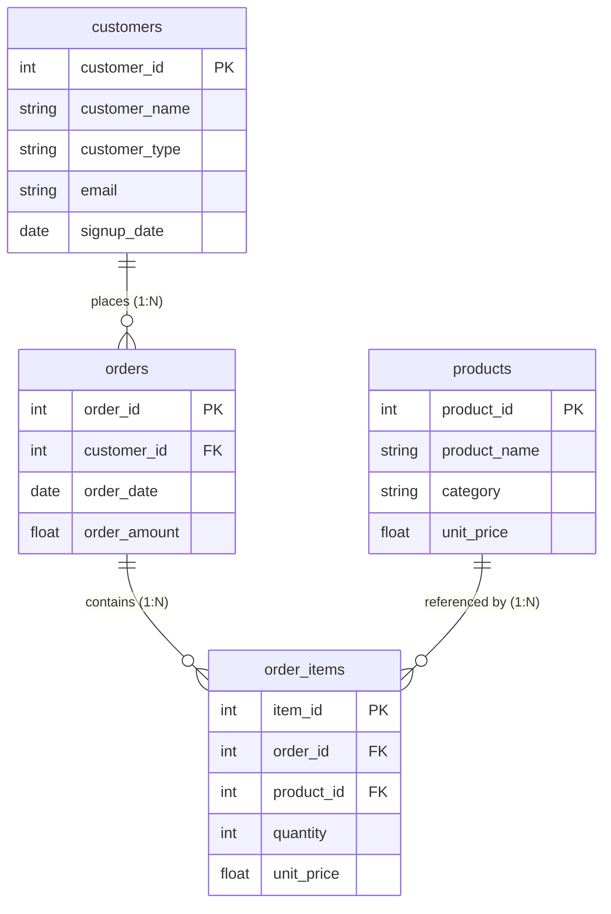

# SQL Joins & Multi-Table Analysis

## Executive Summary

Relational database analysis relies heavily on combining data across separate tables using `JOIN` clauses. However, joins can introduce silent bugs such as row count explosion (fan-out duplication), dropped records due to `INNER JOIN` mismatches, or inaccurate aggregations caused by foreign key anomalies.

This document establishes the official engineering framework for implementing, validating, and documenting SQL joins across multi-table relational schema pipelines in **TraceOps**.

---

## 1. Relational Join Fundamentals

### Core Join Types & Set Semantics

| Join Type | Description | Result Size Bound | Use Case |
| :--- | :--- | :--- | :--- |
| **`INNER JOIN`** | Retains only matching rows present in both left and right tables. | `Result <= min(Left, Right)` | Cohort analysis of active purchasing customers. |
| **`LEFT JOIN`** | Retains all left table rows, extending with right table matches (or `NULL`s). | `Result >= Left` | Full customer base analysis (active & non-active). |
| **`FULL OUTER JOIN`** | Retains all rows from both left and right tables regardless of match. | `Result >= max(Left, Right)` | Complete audit for orphaned records & disconnected entities. |

```
    LEFT TABLE                  RIGHT TABLE
+-----------------+         +-----------------+
|  customer_id    |         |   order_id      |
|  customer_type  | ----+   |   customer_id   |
+-----------------+     |   |   order_amount  |
                        |   +-----------------+
                        v
         +-----------------------------+
         |      JOIN RELATIONSHIP      |
         |  c.customer_id = o.cust_id  |
         +-----------------------------+
```

---

## 2. Multi-Table Schema Architecture

The dataset in `analytics.db` models a standard e-commerce / B2B SaaS data warehouse schema:



---

## 3. Implementation Tasks & Validation

### Task 1: LEFT JOIN with Row Count Validation

To guarantee no customers are inadvertently dropped during analysis, a `LEFT JOIN` is performed from `customers` to `orders`.

#### SQL Query ([queries/left_join_row_count_validation.sql](file:///d:/Project/TraceOps/queries/left_join_row_count_validation.sql))

```sql
SELECT 
    c.customer_id,
    c.customer_type,
    COUNT(DISTINCT o.order_id) as order_count,
    COALESCE(SUM(o.order_amount), 0.0) as total_spent
FROM customers c
LEFT JOIN orders o ON c.customer_id = o.customer_id
GROUP BY c.customer_id, c.customer_type
ORDER BY total_spent DESC NULLS LAST;
```

#### Validation Output Metrics
- **Base Customer Rows:** 1,000
- **Raw Un-aggregated LEFT JOIN Rows:** 5,054
- **Multiplicity Factor:** `5.05` rows per customer
- **Grouped Aggregated Result:** 1,000 distinct customer summary rows

---

### Task 2: Detect Unmatched Keys

Detecting unmatched keys isolates inactive entities and identifies data integrity violations (e.g. orphaned orders caused by missing customer foreign keys).

#### SQL Query ([queries/detect_unmatched_keys.sql](file:///d:/Project/TraceOps/queries/detect_unmatched_keys.sql))

```sql
-- 1. Customers with NO orders (Unmatched on Right)
SELECT c.customer_id, c.customer_type, c.signup_date
FROM customers c
LEFT JOIN orders o ON c.customer_id = o.customer_id
WHERE o.order_id IS NULL;

-- 2. Orders with NO matching customer (Orphaned records)
SELECT o.order_id, o.customer_id, o.order_date
FROM orders o
LEFT JOIN customers c ON o.customer_id = c.customer_id
WHERE c.customer_id IS NULL;
```

#### Detection Results
- **Unmatched Customers (0 orders):** 104 rows (`10.4%` of customer base) -> Exported to [unmatched_customers.csv](file:///d:/Project/TraceOps/output/unmatched_customers.csv)
- **Orphaned Orders (missing customer FK):** 50 rows (`1.0%` of order base) -> Exported to [unmatched_orders.csv](file:///d:/Project/TraceOps/output/unmatched_orders.csv)

---

### Task 3: Compare Join Types

Comparing `INNER`, `LEFT`, and `FULL OUTER` joins ensures full visibility over dataset boundaries and validates mathematical set inclusions.

#### SQL Query ([queries/compare_join_types.sql](file:///d:/Project/TraceOps/queries/compare_join_types.sql))

```sql
-- INNER JOIN (Matched only)
SELECT c.customer_id, o.order_id, o.order_amount
FROM customers c INNER JOIN orders o ON c.customer_id = o.customer_id;

-- LEFT JOIN (All customers)
SELECT c.customer_id, o.order_id, o.order_amount
FROM customers c LEFT JOIN orders o ON c.customer_id = o.customer_id;

-- FULL OUTER JOIN (All records)
SELECT c.customer_id, o.order_id, o.order_amount
FROM customers c FULL OUTER JOIN orders o ON c.customer_id = o.customer_id;
```

#### Join Comparison Hierarchy Matrix

| Join Type | Total Result Rows | Returned Record Universe | Assertion Status |
| :--- | :--- | :--- | :--- |
| **`INNER`** | 4,950 | Matched customer orders only | Baseline |
| **`LEFT`** | 5,054 | 4,950 matched + 104 unmatched customers | `LEFT >= INNER` [PASS] |
| **`FULL OUTER`** | 5,104 | 5,054 left join + 50 orphaned orders | `FULL >= LEFT` [PASS] |

---

### Task 4: Multi-Table Join & Duplication Guard

Joining 4 tables (`customers` -> `orders` -> `order_items` -> `products`) introduces a risk of line-item fan-out. We validate that line totals sum up without unexpected duplication.

#### SQL Query ([queries/multi_table_join.sql](file:///d:/Project/TraceOps/queries/multi_table_join.sql))

```sql
SELECT 
    c.customer_id,
    c.customer_type,
    o.order_id,
    o.order_date,
    oi.product_id,
    p.product_name,
    oi.quantity,
    oi.unit_price,
    (oi.quantity * oi.unit_price) as line_total
FROM customers c
LEFT JOIN orders o ON c.customer_id = o.customer_id
LEFT JOIN order_items oi ON o.order_id = oi.order_id
LEFT JOIN products p ON oi.product_id = p.product_id
WHERE c.customer_type = 'Enterprise'
ORDER BY o.order_date DESC;
```

#### Validation Assertion
- **Joined Line Total Sum:** `$563,957.52`
- **Source `order_items` Expected Sum:** `$563,957.52`
- **Delta:** `$0.00` (`abs(joined - expected) < 0.01` [PASS])

---

### Task 5: Join Strategy Documentation & Artifacts

All validation results are persisted in standard JSON and text summary reports:
- [join_validation_report.json](file:///d:/Project/TraceOps/output/join_validation_report.json)
- [sql_joins_summary.txt](file:///d:/Project/TraceOps/output/sql_joins_summary.txt)

---

## 4. Best Practices & Key Takeaways

1. **Always Validate Row Counts Before & After Joining**: Never assume a join produces 1:1 records. Check `COUNT(*)` and distinct key counts.
2. **Detect Orphaned Records Early**: Use `LEFT JOIN ... WHERE right.key IS NULL` to surface missing foreign keys before loading data into downstream reporting.
3. **Avoid Aggregating Higher-Level Metrics on Granular Line Items**: When querying line items, aggregate metrics at the appropriate entity level to prevent accidental revenue multiplication.
